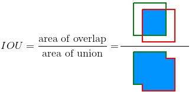

# SSCD
 Salmon Scale Circuli Detector (SSCD)

<!-- The Salmon Scale Circuli Detector (SSCD) was developed....

This repository provides set of tools to run the developed system, to monitor and evaluate its performance and to retrain it when/if necessary.

### Current usage constraints
  - One scale per image
  - scale orientation
  - original image resolutions
  - Magnification

 -->


## Prerequisites

In order to install and use SSCD the following programmes need to be installed:
   - Conda (its lighter version [Miniconda][1] is recommended)
   - [Git][2]

[1]: https://docs.conda.io/en/latest/miniconda.html{:target="_blank"} "Miniconda Installers"
[2]: https://git-scm.com/downloads{:target="_blank"} "Git Installers"

## Installation
<!-- Please take the following steps to install  -->

### 1. Download/clone SSCD code from GitHub
Two options:

  - Download the a zip file with the SSCD code

    1. Go to https://github.com/bcaneco/SSCD
    2. Hit the green dropdown button "Code" and select "Download ZIP"
    3. Extract `SSCD-main.zip` to a directory of your choice
    4. Rename the folder `SSCD-main` as `SSCD`


  - Clone the GitHub repository

    1. Open the command prompt
    2. Go to a directory of your choice (which will comprise SSCD's code)
    3. Clone the SSCD repository by typing the following
    ```
    > git clone https://github.com/bcaneco/SSCD.git
    ```


### 2. Set-up Conda environment for SSCD
This step creates a Conda environment for the SSCD tool, with all the required packages and python dependencies being automatically installed.

  - Open a conda prompt (**Start** > **Anaconda** > **Anaconda Prompt**)
  - Navigate to the SSCD directory
  - Create SSCD environment:
      ```
      > conda env create -f condaenv_sscd.yml
      ```

  - Activate the environment:
    ```
    > conda activate sscd
    ```

  - Add SSCD conda environment to Jupyter notebook
    ```
    > python -m ipykernel install --user --name sscd --display-name "SSCD"
    ```


### 3. Download YOLOv3 weights for focus and circuli detectors

  - Download the file `yoloV3_checkpoints.zip`, containing the trained yolo weights for the two detectors, from [this link][3] (790MB total size, so perhaps time for a break and a cuppa?)

  - Unzip `yoloV3_checkpoints.zip` **inside the subdirectory `SSCD/data/`**.

  - Quick check: e.g. for the focus detector, the path to the directory comprising its weights MUST be `SSCD/data/yoloV3_checkpoints/focus_detector`

  - That's it: installation (probably) done!

[3]: https://www.dropbox.com/sh/xm2zmoz7h9g5nqi/AACfwx7_JQmUkcNK8ePXetkta?dl=0


## How to run SSCD

1. Open a conda prompt (**Start** > **Anaconda** > **Anaconda Prompt**)

2. Go to the SSCD directory

3. Activate the SSCD environment:

  ```
  > conda activate sscd
  ```

4. Two alternatives to run SSCD:

    4.1. Via a Jupyter Notebook (**recommended**)

    - Launch Jupyter lab:

      ```
      > jupyter lab
      ```

    - On Jupyter's File Browser, open `SSCD/docs/SSCD detection example usage.ipynb` and follow the instructions

    - **Alternatively**, open a new Notebook with `SSCD` as its Kernel, copy-paste the following code to a cell

    ```
    %run sscd.py \
       --img_dir "./data/example_scales"\
       --output_dir "C:/SSCD_temp_outputs"\
       --transect_angles 0 45 90 135 180 \
       --plot_detections True
    ```
    and hit `Ctrl+Enter` to run.

    4.2. Via the command prompt (messier because of Tensorflow's verbose logging messages)

    Run the following chunk of code directly into the command line

   ```
   > python sscd.py ^
      --img_dir "./data/example_scales" ^
      --output_dir "C:/SSCD_temp_outputs" ^
      --transect_angles 0 45 90 135 180  ^
      --plot_detections True
   ```


### `sscd.py` inputs

| Argument               | Description                     | Type          | Default         |
|------------------------|---------------------------------|---------------|-----------------|
| `--img_dir`    | Directory path containing scale image files. <br> Expects TIF images  | str  |      |
| `--output_dir` | Directory path where outputs will be stored                           | str  |      |
| `--transect_angles` | Choice of angle(s) for radial transects <br> in degrees (0-360)  | int (spaced) | `0 45 90 135 180` |
| `--plot_dets`    | Option to generate images with detections, for visual inspection   | bool   | `True` |
| `--transect_max_boxes` | Maximum number of detections per transect image              | int    | `200`  |


### `sscd.py` outputs

The following directory tree represents how the outputs from SSCD are structured:

<!-- Tree obtained via "tree /F" in command line -->

```
<output_dir>
   ├─── detections
   │   ├─── circuli
   │   │     │   ├─── circuli_spacings.csv
   │   │     │   └─── detections.csv
   │   │     │
   │   │     └─── detection_images
   │   │           ├─── N Esk NC_2018_273_0_detections.jpg
   │   │           ├─── N Esk NC_2018_273_180_detections.jpg
   │   │           ├─── N Esk NC_2018_273_225_detections.jpg
   │   │           ├─── N Esk NC_2018_273_270_detections.jpg
   │   │           ├─── N Esk NC_2018_273_315_detections.jpg
   │   │           ├─── N Esk NC_2018_273_90_detections.jpg
   |   |           ...
   │   │
   │   └─── focus
   │         │  └─── detections.csv
   │         │
   │         ├─── detection_images
   │         │      ├─── N Esk NC_2018_273_detections.jpg
   │         │      ├─── N Esk NC_2018_354_detections.jpg
   │         │      ...
   │         │
   │         └─── imgs_with_no_detections
   │               ├─── N Esk NC_2018_303.jpeg
   │               ...
   │
   ├─── jpegs
   |     ├─── scales
   |     │      ├─── N Esk NC_2018_273.jpg
   |     │      ├─── N Esk NC_2018_303.jpg
   |     │      ...
   |     │
   |     └─── transects
   |          ├─── N Esk NC_2018_273_0.jpg
   |          ├─── N Esk NC_2018_273_180.jpg
   |          ├─── N Esk NC_2018_273_225.jpg
   |          ├─── N Esk NC_2018_273_270.jpg
   |          ├─── N Esk NC_2018_273_315.jpg
   |          ├─── N Esk NC_2018_273_90.jpg
   |          ...
   |
   └─── log_sscd_detection.log
```


- The `/jpegs` folder comprises images generated during the process, i.e. the JPEG versions of the original TIF scale drwn images and the transect images
- The `/detections` folder comprises the detection data from each detector (e.g. `/detections/focus/detections.csv`), the circuli spacings (`detections/circuli/circuli_spacings.csv`), and subdirectories containing images with detection boxes drawn in them if `--plot_dets` is set to `True` (e.g. `/detections/focus/detection_images`)
- `log_sscd_detection.log` contains logging messages generated during the detection process, providing useful info from each step of the detection pipeline
- In addition, images where detectors fail to locate the scale focus, or any circuli bands in a transect, are copied to a dedicated directory (e.g. `output_dir/detections/focus/imgs_with_no_detections`)


## Evaluating SSCD's performance

Evaluating the performance of the SCCD is crucial to identify degradation in the system's capacity to produce reliable detections of circuli bands, and subsequently provide accurate intercirculi spacings. Consistent drops in performance metrics on new images, compared to [those][5] obtained when the system was last trained, indicates the system needs to be retrained with fresh images.

The performance of each detector comprised in SSCD's pipeline can be evaluated via the `eval_detector.py` script. This tool combines outputs from the `sscd.py` script with annotation data (provided by the user) to produce standard object detection performance metrics.

Core computational tasks were adapted from [this project][4], where background information on evaluation methods for object detection algorithms and performance metrics can also be found.

A detailed protocol for evaluating the performance of SSCD's detectors is available [here][5].


[4]: (https://github.com/rafaelpadilla/Object-Detection-Metrics#how-to-use-this-project)
[5]: ./sscd_evaluate.md


The following code chunk exemplifies the evaluation of the circuli detector in a jupyter session (under the sscd kernel):

```
%run eval_detector.py \
    --img_dir "./data/eval_example/imgs/" \
    --anns_dir "./data/eval_example/anns/" \
    --dets_csv "./data/eval_example/detections.csv"\
    --iou_threshould 0.5 \
    --output_dir "C:/SSCD_temp_outputs"\
    --dets_vs_anns_plots True \
    --sep_plots True
```

Running the same case usage via the command line (copy-pasting):

```
python eval_detector.py ^
    --img_dir "./data/eval_example/imgs/" ^
    --anns_dir "./data/eval_example/anns/" ^
    --dets_csv "./data/eval_example/detections.csv" ^
    --iou_threshould 0.5 ^
    --output_dir "C:/SSCD_temp_outputs" ^
    --dets_vs_anns_plots True ^
    --sep_plots True
```

### `eval_detector.py` inputs


| Argument     | Description                                             | Type          | Default  |
|--------------|-------------------------------------------------------- |---------------|----------|
| `--img_dir`  | Directory path to images for evaluation. Expects JPEG images   | str    |          |
| `--anns_dir` | Directory path to annotation files. Expects XML files with Pascal VOC format  | str  |       |
| `--dets_csv` | Filepath to CSV file containing detection bounding boxes, as outputted from `sscd.py`| str | |
| `--iou_threshould` | IOU threshold (IOU<sub>thresh</sub>) determining if a detection is TP or FP (see "Metrics" section bellow) | float  | `0.5`  |
| `--output_dir`| Directory path to evaluation outputs                          | str           |          |
| `--plot_dets_vs_anns` | Option to generate image plots contrasting detections with annotations | bool   | `True` |
| `--sep_plots` | Option to produce separate plots for detections and annotations. If `False` draw both in the same plot (recommended for focus detections) | bool  | `False`  |


### `eval_detector.py` outputs

Evaluation metrics are printed to the active console, and stored with other relevant outputs as follows (for the above example case):


```
<output_dir>
    ├─── dets_vs_anns_plots
    |        ├─── N Esk NC_2018_186_0_detections.jpg
    |        ├─── N Esk NC_2018_186_180_detections.jpg
    |        ├─── N Esk NC_2018_186_90_detections.jpg
    |        ...
    |
    ├─── circulus_PRC.png
    ├─── evaluation_results.txt
    ├─── log_sscd_evaluation.log
    └─── "results_by_image.csv"
```

where:
  - `circulus_PRC.png` - Precision-Recall curve for the object class under evaluation
  - `evaluation_results.txt` - Main evaluation metrics
  - `log_sscd_evaluation.log` - logging messages generated during the evaluation process
  - `results_by_image.csv` - Classification of detections by image
  - `/dets_vs_anns_plots` - contains detections vs. annotations image plots


#### Definitions and Metrics:
  - Intersection Over Union (IOU):  the overlapping area between the detection bounding box and the annotation bounding box divided by the area of union between them:

  

  - IOU threshold (IOU<sub>thresh</sub>): used to determine if a detection is classified as True Positive or False Positive
  - True Positive (TP): a correct detection (i.e. detection with IOU &ge; IOU<sub>thresh</sub>)
  - False Positive (FP): an incorrect detection (i.e. detection with IOU &lt; IOU<sub>thresh</sub> **OR** an extra TP on the same annotation)
  - False Negative (FN): an undetected annotation
  - Precision: the proportion of correct positive detections = TP/(TP+FP)
  - Recall: the proportion of annotations correctly detected (*true positive rate*) = TP/(TP+FN)
  - Average precision (AP): combines precision and recall by
  - F<sub>1</sub> score: the harmonic mean of precision and recall. Higher scores when both recall and precision are high.
  - Mean Centre Error (MCE): average of Euclidian distances (in pixels) between the centres of TP detection boxes and respective annotation boxes


> **Note of caution**
>
> Annotations are not ground truths in a strict sense. Target objects are marked manually and thence subject to human error and labeller ambiguity. Therefore, performance metrics are highly dependent, not only on the accuracy of the detector, but also on the quality of annotations used on the evaluation. Image plots contrasting detections against annotations should help scrutinise if apparent drops in performance metrics are being driven by a deteriorating detector, by poor labelling, or both.


<!--
### how to update conda environment
```
conda env update --name sscd --file condaenv_sscd.yml  --prune

``` -->


### References (supporting code)
- [YOLOv3 implementation in Tensorflow 2](https://github.com/zzh8829/yolov3-tf2)
- [Diagonal crop](https://github.com/jobevers/diagonal-crop)
- Object detection evaluation [tool](https://github.com/rafaelpadilla/Object-Detection-Metrics#how-to-use-this-project)
