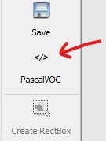
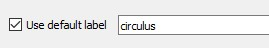

# Evaluating SSCD's performance

### Overview

Here we provide a guide for evaluating the performance of the Salmon Scale Circuli Detector (SSCD) on new, unseen to training, images. SSCD is composed by two distinct object detection models, the **focus** and the **circulus** detectors, and evaluation must therefore be carried separately for each detector.

Performance evaluation is based on geometric-based comparisons between detections and *ground truth* data (also referred to as annotations). In the context of object detection, ground truths consist of (manually) marked bounding boxes delimiting target objects in images.

This guide assumes the detection step has been already carried out (using the [`sscd.py`](../README.md#how-to-run-sscd)  function), and the goal now is to assess the performance of one of the detectors on a set of images used in detection. Obtained evaluation metrics can then be contrasted with those observed when the detector was last trained. Considerable drops (>10%) in metrics provide a strong indication that the detector's expected prediction accuracy has declined, and therefore it should be retrained with fresh images.

The following table provides the evaluation metrics of each detector obtained on the test set at the time of the last training.

###### Evaluation metrics on test set
| Model            | Training date  | No. of images  | IOU<sub>Thresh</sub> | Average Precision (AP) | F<sub>1</sub>   |
|------------------|----------------|----------------|----------------------|------------------------|-----------------|
| Focus detector   | July 2020      | 103            |  0.5                 | 99.0%                  | 0.99            |
| Circulus detector| December 2020  | 81             |  0.5                 | 95.2%                  | 0.94            |

<br/>
<!-- An important caveat of the evaluation process is the quality of the annotation data. Labelling, the process by which ground truths are generated, needs to be as accurate and consistent as possible Labelling circulus, in particular, may at times be challenging as identifying circuli bands can be ambiguous due to e.g. bands being too packed (specially on river growth), poor scale-to-slide imprinting or the occurrence of fissures/discontinuities in scale deposition. Poor quality annotation data will have a negative impact on performance metrics while the detector is still operating at expected levels of accuracy, potentially prompting the user to needlessly retrain the detector. Visual inspection of detections vs annotations plots could help to discern decay in the detector's performance from poor labelling. -->

An important caveat of the evaluation process is the quality of the annotation data:

  - Labelling, the process by which ground truths are generated, needs to be as accurate and consistent as possible.

  - Labelling circulus, in particular, may at times be challenging as identifying circuli bands can be ambiguous due to e.g. packed bands (specially on river growth), poor scale-to-slide imprinting or the occurrence of fissures/discontinuities in scale deposition.

  - Poor quality annotation data will have a negative impact on performance metrics while the detector is still operating at expected levels of accuracy, potentially prompting the user to needlessly retrain the detector.

  - Visual inspection of detections vs annotations plots could help to discern decay in the detector's performance from poor labelling.

<br/>

### Additional software requirements

There are [many][1] annotation tools available for labelling objects in images.

For its simplicity, speed and ease of use, we recommend [*LabelImg*][2]. For installation, follow the [instructions][4] according to the appropriate OS.

Please note, the evaluation tool expects annotation files to be in Pascal VOC format. Thus, if using a different annotation software  without the option of Pascal VOC as an output format, annotations will need to be converted accordingly (e.g. this [python package][3] offers a range of format conversions).


## Evaluation walkthrough example

  - We assume `sscd.py` has already been run on a set of images, and *LabelImg* has been correctly installed.

  - During the detection step, jpg versions of the scales and transect images used in detection are stored in the subdirectory `<output_dir>\jpegs`.

  - The example described here refers to the evaluation of the circulus detector.

  - To evaluate the performance of the focus detector, follow the same steps.


#### 1. Setting-up directories and files to use in evaluation

- Create a main directory to comprise the files required for the evaluation process (e.g. `<some_path>/eval_circuli_detector`)

- Select and copy the images to be used in the evaluation from the directory containing the transect images generated during detection (`<detections_output_dir>/jpegs/transects`) to a dedicated subdirectory (e.g. `<some_path>/eval_circuli_detector/imgs`).

- Create a new subdirectory to take the annotation files (e.g. `<some_path>/eval_circuli_detector/anns`)

- Optionally, for easier reference, copy the circuli detection data (`<detections_output_dir>/detections/circuli/detections.csv`) to the main directory created above (i.e. `<some_path>/eval_circuli_detector/detections.csv`)


#### 2. Label the images

- Open an Anaconda Prompt, go to the *LabelImg* directory and launch it

  ```
  python labelImg.py
  ```
- Go to `File > Open Dir` and select image directory (here, `<some_path>/eval_circuli_detector/imgs`)
- Go to `File > Change Save Dir` and select the annotations directory (here, `<some_path>/eval_circuli_detector/anns`)
- Make sure the PascalVOC option is selected

  

- On the left side panel, tick the box "use default label" and write `circulus` on the adjacent text box

  

- Proceed with the labelling process, by using the rectangular box to delimit **every circulus** present in each image

- Tip - particularly useful [hotkeys](https://github.com/tzutalin/labelImg#hotkeys) include:
  - create a new box (w)
  - copy the current box ("Ctrl + d"),
  - save annotation file (Ctrl + s)
  - move to next image (d)


#### 3. Run evaluation (in jupyter session)

- In a jupyter session under the sscd kernel, run the following code, **using the appropriate paths and directory names**

  ```
  %run eval_detector.py \
      --img_dir `<some_path>/eval_circuli_detector/imgs` \
      --anns_dir `<some_path>/eval_circuli_detector/anns` \
      --dets_csv "<some_path>/eval_circuli_detector/detections.csv"\
      --iou_threshould 0.5 \
      --output_dir "<some_path>/eval_circuli_detector/"\
      --plot_dets_vs_anns True \
      --sep_plots True
  ```


<!-- - Launch *LabelImg* by running the following command, **using the appropriate paths and directory names** (tip: use a text editor to help specifying the correct paths before copy-pasting it to the command line)

  ```
  python labelImg.py "<some_path>/evaluation_inputs/imgs" "<some_path>/evaluation_inputs/anns" "<path_to_SSC>/data/labelImg_sscd_classes.txt"
  ``` -->


[1]: https://www.simonwenkel.com/2019/07/19/list-of-annotation-tools-for-machine-learning-research.html
[2]: https://github.com/tzutalin/labelImg#labelimg
[3]: https://github.com/monocongo/cvdata
[4]: https://github.com/tzutalin/labelImg#windows--anaconda
